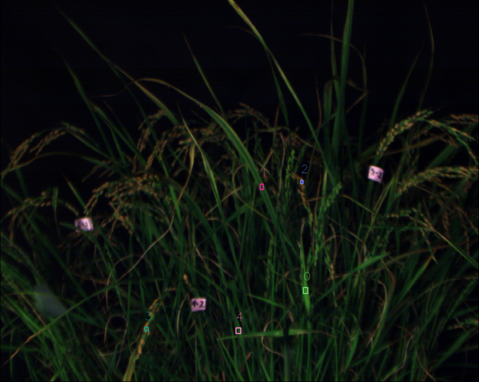

# ENVI tools

## Introduction

This project provides simple tools to deal with reflectance ENVI files.
Currently, the following tools (functions) are available.

- Sampling reflectance of RoIs.
- Color enhancement.
- Mean reflectance calculation within pre-defined polygons.

---
## Sampling reflectance of RoIs. (`sample_rois` function)
This function extracts mean spectra within RoIs after users define the RoIs manually.

1. **Installing necesary dependencies**
   - Install necessary dependencies by referring to `envi_tool.py` and `envi_tool_demo_sample_rois.py`.
     
2. **Running code**
   - Specify `envi_fname` in `envi_tool_demo_sample_rois.py`, then run the following command:
```bash
python envi_tool_demo_sample_rois.py
```

3. **Selecting RoIs**
   - Select RoIs. After each selection, type `space` key. To finish selection, type `esc`.

**Seelction of RoIs (bboxes)**:



4. **Reflectance plot**
   - Averaged reflectances of RoIs shows up.

**Averaged reflectances of RoIs**:


---
## Color enhancement. (`color_enhancement` function)
In general, inteinsities of leaf areas in color images generated from reflectance hyperspecral data is low.
This is because leaf reflectance is low.
This function makes plants brighter by maximizing intensity in RoI.

**Video of operation**:
https://github.com/user-attachments/assets/12e5cb87-8d0b-4ebe-bb0c-27d92f1c0c53

1. **Installing necesary dependencies**
   - Install necessary dependencies by referring to `envi_tool.py` and `envi_tool_demo_color_enhanncement.py`.
     
2. **Running code**
   - Specify `envi_fname` in `envi_tool_demo_color_enhancement.py`, then run the following command:
```bash
python envi_tool_demo_color_enhancement.py
```

3. **Selecting RoI**
   - Select RoI. Type `space` key and, then, type `Enter`.

4. **Display of original and enhance color images**
   - Original and enhance color images show up.

**Original color image**:


**Enhanced color image**:


---
## Mean reflectance calculation within pre-defined polygons. (`polygon2csv` function)
This function extracts mean spectra within pre-defined polygons in COCO format.

1. **Preparing COCO format polygon annotations**
   - Annotate objects by polygons in color image generated from reflectance ENVI file.
   - We assume all the objects belong to identical category (e.g., leaf).
   - The order of annotations should be recorded because the order of extracted mean reflectance in final product (csv) follows the order of annotations.

2. **Installing necesary dependencies**
   - Install necessary dependencies by referring to `envi_tool.py` and `envi_tool_demo_polygon2csv.py`.
     
2. **Running code**
   - Specify `json_fname`, `envi_fname`, `csv_fname` and `label_start` in `envi_tool_demo_polygon2csv.py`, then run the following command:
```bash
python envi_tool_demo_polygon2csv.py
```
   - `json_fname`: Polygon annotation file in COCO format. The image is generated from `envi_fname`.
   - `envi_fname`: Reflectance ENVI file.
   - `csv_fname`: Output csv file.
   - `label_start`: Label of the first annotation. The label increments by 1 following the order of annotations. If `label_start=51`, labels will be 51, 52, 53...

3. **Selecting RoI**
   - Select RoI. Type `space` key and, then, type `Enter`.

4. **Display of original and enhance color images**
   - Original and enhance color images show up.

**Original color image**:


**Enhanced color image**:


